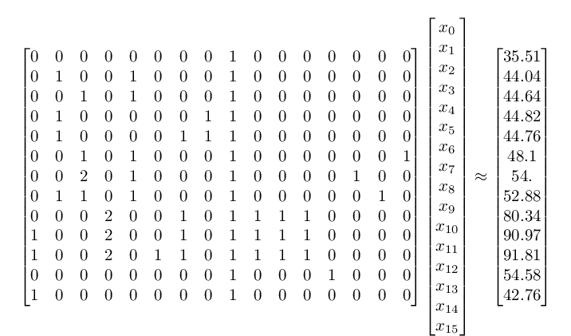
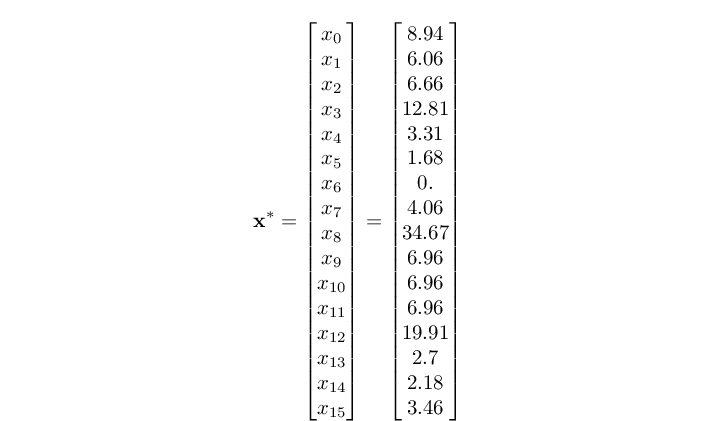

# Opcode Pricing

We have designed a [pricing mechanism](https://www.overleaf.com/read/qdgrnfdspjgd) to maximize transaction throughput in the fetch.ai ledger by incentivizing transactions to use a small number of resource lanes (or shards) and occupy the least congested lanes. Such a policy promotes efficient operation of an ideal ledger, but it is based on the assumption that transaction fees depend on lane usage alone. Ultimately, the price of transactions should also relate to the actual cost of maintaining the ledger, which in the case of digital tokens, is proportional to the resources consumed by the servers responsible for validating transactions. At a basic level, this can be expressed in terms of the expected number of CPU cycles and memory space needed to validate a transaction. Since transactions include smart contracts and are expressed in a programming language (Etch), they consist of a sequence of machine instructions. Estimates of the CPU time required by a transaction can therefore be decomposed into the times of the constituent instructions or opcodes.

In the fetch.ai distributed ledger, transactions are typically submitted via [Etch-code](https://docs.fetch.ai/etch-language/). Therefore, we estimate the CPU requirements of each opcode in the fetch.ai virtual machine by isolating it as much as possible in a compiled piece of Etch code. For example, if we want to compute the CPU requirements for adding two 32-bit integers, we can compile and time the following Etch code:
```c
function PrimitiveAdd()
var x : Int32 = 1i32;
x + x;
endfunction
```
If we look at the opcodes that result from compiling this code, we get:

	7 PushConstant
	2 VariableDeclareAssign
	8 PushVariable
	8 PushVariable
	48 PrimitiveAdd
	14 Discard
	21 Return

Since we are interested in timing the add operation, we also time the following code for use as as a baseline:
```c
function PushVariable()
var x : Int32 = 1i32;
x;
endfunction
```
This code runs the following opcodes:

	7 PushConstant
	2 VariableDeclareAssign
	8 PushVariable
	14 Discard
	21 Return

By subtracting the time of **PushVariable** from **PrimitiveAdd**, we obtain an estimate of the opcodes 8 (**PushVariable**) and 48 (**PrimitiveAdd**). Note that the primitive add operation requires pushing two variables to the stack. Since the arithmetic operations will almost always be executed after a push operation, we include both together in the benchmark timings. Similarly for the discard operation (14) after a push. However, we will show one way to estimate the isolated opcode times in the next section. Using the [Google benchmark library](https://github.com/google/benchmark) to run 100 repetitions of each compiled function, we obtain the following output:

	Run on (8 X 4000 MHz CPU s)
	CPU Caches:
	L1 Data 32K (x4)
	L1 Instruction 32K (x4)
	L2 Unified 256K (x4)
	L3 Unified 8192K (x1)
	------------------------------------------------------------------------------------
	Benchmark Time CPU Iterations
	------------------------------------------------------------------------------------
	OpcodeBenchmark/PushVariable_mean 53 ns 53 ns 13084724
	OpcodeBenchmark/PushVariable_median 53 ns 53 ns 13084724
	OpcodeBenchmark/PushVariable_stddev 0 ns 0 ns 13084724
	OpcodeBenchmark/PrimitiveAdd_mean 64 ns 64 ns 11084146
	OpcodeBenchmark/PrimitiveAdd_median 64 ns 64 ns 11084146
	OpcodeBenchmark/PrimitiveAdd_stddev 1 ns 1 ns 11084146

Since the measure of interest is the mean CPU time, we compute the standard error in the mean: &sigma;/*n*, where &sigma; denotes the standard deviation and *n* the number of repetitions. By this methodology, we can generate tables like the following, showing the mean CPU times for opcodes that do not depend on a variable or primitive.

### <a name="table1">Table 1</a>: CPU times for basic type-independent benchmarks
| Benchmark (200 reps)   |   Mean (ns) |   Net mean (ns) |   Std error (ns) | Opcodes                           | Baseline     | Net opcodes            |
|------------------------|-------------|-----------------|------------------|-----------------------------------|--------------|------------------------|
| Return                 |       35.51 |            0.00 |             0.16 | [21]                              | Return       | []                     |
| PushFalse              |       44.04 |            8.53 |             0.12 | [4, 14, 21]                       | Return       | [4, 14]                |
| PushTrue               |       44.64 |            9.13 |             0.13 | [5, 14, 21]                       | Return       | [5, 14]                |
| JumpIfFalse            |       44.82 |            9.31 |             0.12 | [4, 19, 21]                       | Return       | [4, 19]                |
| Jump                   |       44.76 |           -0.06 |             0.02 | [4, 19, 18, 21]                   | JumpIfFalse  | [18]                   |
| Not                    |       48.10 |            3.46 |             0.07 | [5, 33, 14, 21]                   | PushTrue     | [33]                   |
| And                    |       54.00 |            9.36 |             0.07 | [5, 31, 5, 14, 21]                | PushTrue     | [31, 5]                |
| Or                     |       52.88 |            8.24 |             0.07 | [4, 32, 5, 14, 21]                | PushTrue     | [4, 32]                |
| ForLoop                |       80.34 |           44.83 |             0.13 | [7, 7, 23, 24, 18, 25, 21]        | Return       | [7, 7, 23, 24, 18, 25] |
| Break                  |       69.25 |          -11.09 |             0.06 | [7, 7, 23, 24, 16, 18, 25, 21]    | ForLoop      | [16]                   |
| Continue               |       79.53 |           -0.81 |             0.10 | [7, 7, 23, 24, 17, 18, 25, 21]    | ForLoop      | [17]                   |
| DestructBase           |       90.97 |           10.64 |             0.08 | [1, 7, 7, 23, 24, 18, 25, 21]     | ForLoop      | [1]                    |
| Destruct               |       91.81 |            0.84 |             0.08 | [7, 7, 23, 24, 1, 15, 18, 25, 21] | DestructBase | [15]                   |
| Function               |       54.58 |           19.07 |             0.12 | [26, 21]                          | Return       | [26]                   |
| VariableDeclareStr     |       42.76 |            7.25 |             0.12 | [1, 21]                           | Return       | [1]                    |

## Least-squares estimation of isolated opcode times

In the previous section, we found that some of the opcodes always appear in pairs. For example, arithmetic operations are almost always preceded by a PushVariable operation and isolated push operations are almost always followed by a Discard operation. As we will see later on, this also arises in more complex operations. Since it would be ideal to measure the CPU times for each opcode in isolation, we show one way to estimate these times here.

Let *A* be a matrix where each row corresponds to a benchmark and each element *A<sub>ij</sub>=k* if benchmark *i* uses opcode a total of *k* times. Let ***b*** be a vector where each element *b<sub>i</sub>* is the mean measured CPU time corresponding to benchmark *i*. Then the solution to ***x***<sup>\*</sup> = arg min(||*A****x*** - ***b***||<sup>2</sup>) provides an estimate of the individual opcode times, where each *x<sub>i</sub>* represents the CPU time required by opcode *i*.

For the benchmarks listed in [Table 1](#table1), we seek values in the vector ***x*** that make the following expression as close as possible to an equality.



In addition to minimizing ||*A****x*** - ***b***||<sup>2</sup>, we also need to constrain the individual opcode times to be positive (*x<sub>i</sub> > 0* for each *i*). Finally, since CPU times vary more for some benchmarks than others, we normalize the expression by the standard deviation and rewrite the expression as follows:


The solution of the above example is:



where the values of **x** are given in nanoseconds and the corresponding opcodes are defined as {1: VariableDeclare, 4: PushFalse, 5: PushTrue, 7: PushConstant, 14: Discard, 15: Destruct, 18: Jump, 19: JumpIfFalse,  21: Return, 23: ForRangeInit, 24: ForRangeIterate, 25: ForRangeTerminate, 26: InvokeUserDefinedFreeFunction, 31: JumpIfFalseOrPop, 32: JumpIfTrueOrPop, 33: Not}.

We can then use these estimates to decouple the opcode times listed in [Table 1](#table1), which can then be subtracted wherever they appear in other benchmarks. Discrepancies between the Mean column and total estimated time reflect the fact that the least-squares fit is necessarily an approximation.

### <a name="table2">Table 2</a>: Basic benchmarks decomposed into estimated individual opcode times
| Benchmark (200 reps)   |   Mean (ns) |   Std. error (ns) | Opcodes: estimated times (ns)                                                 |
|------------------------|-------------|-------------------|-------------------------------------------------------------------------------|
| Return                 |       35.51 |              0.16 | {21: 33.3}                                                                    |
| PushFalse              |       44.04 |              0.12 | {4: 6.29, 14: 4.45, 21: 33.3}                                                 |
| PushTrue               |       44.64 |              0.13 | {5: 6.89, 14: 4.45, 21: 33.3}                                                 |
| JumpIfFalse            |       44.82 |              0.12 | {4: 6.29, 19: 5.18, 21: 33.3}                                                 |
| Jump                   |       44.76 |              0.02 | {4: 6.29, 19: 5.18, 18: 0.0, 21: 33.3}                                        |
| Not                    |       48.10 |              0.07 | {5: 6.89, 33: 3.46, 14: 4.45, 21: 33.3}                                       |
| And                    |       54.00 |              0.07 | {5: 6.89, 31: 2.47, 14: 4.45, 21: 33.3}                                       |
| Or                     |       52.88 |              0.07 | {4: 6.29, 32: 1.95, 5: 6.89, 14: 4.45, 21: 33.3}                              |
| ForLoop                |       80.34 |              0.13 | {7: 13.46, 23: 6.87, 24: 6.87, 18: 0.0, 25: 6.87, 21: 33.3}                   |
| DestructBase           |       90.97 |              0.08 | {1: 9.49, 7: 13.46, 23: 6.87, 24: 6.87, 18: 0.0, 25: 6.87, 21: 33.3}          |
| Destruct               |       91.81 |              0.08 | {7: 13.46, 23: 6.87, 24: 6.87, 1: 9.49, 15: 1.5, 18: 0.0, 25: 6.87, 21: 33.3} |
| Function               |       54.58 |              0.12 | {26: 21.28, 21: 33.3}                                                         |
| VariableDeclareStr     |       42.76 |              0.12 | {1: 9.49, 21: 33.3}                                                           |

See [Appendix](#app) for the list of all parameter-independent opcodes.

## Primitive opcodes

We tested the primitive opcodes for each of the different primitives to determine if there is any significant difference in CPU time. [Table 3](#table3) shows that the different integer types result only in very small variations in CPU time.

### <a name="table3">Table 3</a>: Mean CPU times for integer primitive opcodes (+/- std error)
| Benchmark (100 reps)        | Int16 (ns)   | Int32 (ns)   | Int64 (ns)   | Int8 (ns)    | UInt16 (ns)   | UInt32 (ns)   | UInt64 (ns)   | UInt8 (ns)   |
|-----------------------------|--------------|--------------|--------------|--------------|---------------|---------------|---------------|--------------|
| PrimAdd                     | 11.46 ± 0.15 | 11.05 ± 0.13 | 12.06 ± 0.10 | 10.24 ± 0.11 | 11.96 ± 0.07  | 11.41 ± 0.19  | 11.88 ± 0.05  | 11.88 ± 0.06 |
| PrimDivide                  | 14.75 ± 0.12 | 14.59 ± 0.25 | 18.23 ± 0.10 | 15.59 ± 0.22 | 14.68 ± 0.07  | 14.19 ± 0.20  | 17.88 ± 0.10  | 14.16 ± 0.08 |
| PrimEqual                   | 13.80 ± 0.10 | 13.59 ± 0.07 | 13.67 ± 0.07 | 15.58 ± 0.28 | 14.02 ± 0.07  | 13.59 ± 0.19  | 14.21 ± 0.06  | 15.33 ± 0.24 |
| PrimGreaterThan             | 14.13 ± 0.09 | 14.02 ± 0.08 | 13.37 ± 0.12 | 15.09 ± 0.22 | 14.13 ± 0.12  | 14.11 ± 0.19  | 14.23 ± 0.06  | 14.10 ± 0.06 |
| PrimGreaterThanOrEqual      | 13.80 ± 0.09 | 14.05 ± 0.07 | 12.90 ± 0.12 | 14.63 ± 0.15 | 13.94 ± 0.09  | 13.93 ± 0.19  | 13.88 ± 0.06  | 14.15 ± 0.07 |
| PrimLessThan                | 14.38 ± 0.14 | 13.74 ± 0.06 | 13.23 ± 0.09 | 15.20 ± 0.21 | 14.01 ± 0.14  | 14.55 ± 0.20  | 13.93 ± 0.10  | 14.27 ± 0.07 |
| PrimLessThanOrEqual         | 14.14 ± 0.09 | 13.44 ± 0.10 | 13.38 ± 0.12 | 14.99 ± 0.17 | 14.66 ± 0.07  | 14.03 ± 0.19  | 14.23 ± 0.07  | 14.44 ± 0.09 |
| PrimMultiply                | 14.83 ± 0.09 | 14.18 ± 0.06 | 14.25 ± 0.06 | 14.34 ± 0.23 | 14.82 ± 0.08  | 13.87 ± 0.20  | 14.32 ± 0.06  | 13.95 ± 0.09 |
| PrimNegate                  | 4.70 ± 0.08  | 4.50 ± 0.06  | 4.78 ± 0.10  | 5.71 ± 0.20  | 5.05 ± 0.07   | 4.65 ± 0.19   | 5.48 ± 0.08   | 5.21 ± 0.07  |
| PrimNotEqual                | 14.13 ± 0.12 | 13.80 ± 0.08 | 13.15 ± 0.12 | 16.03 ± 0.27 | 14.21 ± 0.12  | 13.82 ± 0.23  | 14.02 ± 0.06  | 14.39 ± 0.07 |
| PrimPopToVariable           | 9.63 ± 0.06  | 9.70 ± 0.07  | 9.19 ± 0.13  | 9.03 ± 0.04  | 9.49 ± 0.04   | 9.35 ± 0.04   | 9.87 ± 0.20   | 9.28 ± 0.07  |
| PrimPushConst               | 9.07 ± 0.15  | 8.86 ± 0.15  | 8.79 ± 0.15  | 8.33 ± 0.15  | 9.11 ± 0.21   | 9.02 ± 0.15   | 8.56 ± 0.15   | 8.61 ± 0.15  |
| PrimPushVariable            | 10.50 ± 0.08 | 10.87 ± 0.06 | 10.81 ± 0.05 | 10.72 ± 0.12 | 10.44 ± 0.15  | 10.95 ± 0.19  | 10.85 ± 0.05  | 10.89 ± 0.06 |
| PrimReturnValue             | 5.79 ± 0.17  | 5.54 ± 0.15  | 5.36 ± 0.15  | 5.29 ± 0.15  | 5.32 ± 0.15   | 5.39 ± 0.15   | 5.60 ± 0.16   | 5.42 ± 0.15  |
| PrimSubtract                | 11.59 ± 0.13 | 11.68 ± 0.06 | 11.15 ± 0.11 | 10.88 ± 0.16 | 11.81 ± 0.10  | 11.31 ± 0.19  | 11.85 ± 0.09  | 11.66 ± 0.12 |
| PrimVariableDeclare         | 3.45 ± 0.15  | 3.46 ± 0.17  | 3.25 ± 0.16  | 3.17 ± 0.15  | 3.09 ± 0.15   | 3.05 ± 0.15   | 3.33 ± 0.15   | 3.05 ± 0.15  |
| PrimVariableDeclareAssign   | 10.64 ± 0.15 | 10.40 ± 0.15 | 10.58 ± 0.19 | 10.37 ± 0.15 | 10.36 ± 0.15  | 10.41 ± 0.15  | 10.30 ± 0.15  | 10.37 ± 0.16 |
| PrimVariableInplaceAdd      | 10.16 ± 0.04 | 10.56 ± 0.04 | 10.16 ± 0.13 | 10.86 ± 0.06 | 10.70 ± 0.05  | 10.79 ± 0.09  | 10.69 ± 0.05  | 10.36 ± 0.07 |
| PrimVariableInplaceDivide   | 12.40 ± 0.06 | 12.57 ± 0.04 | 17.35 ± 0.14 | 13.14 ± 0.05 | 12.24 ± 0.07  | 12.66 ± 0.05  | 17.32 ± 0.04  | 12.62 ± 0.13 |
| PrimVariableInplaceMultiply | 11.01 ± 0.04 | 11.12 ± 0.03 | 11.15 ± 0.14 | 11.60 ± 0.05 | 11.25 ± 0.04  | 11.52 ± 0.05  | 11.28 ± 0.04  | 11.33 ± 0.08 |
| PrimVariableInplaceSubtract | 10.47 ± 0.06 | 10.58 ± 0.11 | 10.16 ± 0.13 | 10.96 ± 0.05 | 10.62 ± 0.05  | 10.80 ± 0.05  | 10.97 ± 0.17  | 10.50 ± 0.07 |
| PrimVariablePostfixDec      | 9.95 ± 0.03  | 10.53 ± 0.04 | 10.17 ± 0.13 | 10.86 ± 0.05 | 10.73 ± 0.19  | 10.59 ± 0.05  | 10.80 ± 0.05  | 10.29 ± 0.08 |
| PrimVariablePostfixInc      | 10.00 ± 0.04 | 10.63 ± 0.05 | 10.12 ± 0.24 | 10.66 ± 0.05 | 10.45 ± 0.11  | 10.54 ± 0.05  | 10.96 ± 0.06  | 10.30 ± 0.12 |
| PrimVariablePrefixDec       | 10.07 ± 0.04 | 10.68 ± 0.08 | 9.73 ± 0.15  | 10.60 ± 0.05 | 9.79 ± 0.06   | 10.68 ± 0.05  | 10.81 ± 0.05  | 10.62 ± 0.09 |
| PrimVariablePrefixInc       | 10.59 ± 0.17 | 11.15 ± 0.05 | 10.52 ± 0.14 | 10.95 ± 0.16 | 9.80 ± 0.08   | 11.19 ± 0.09  | 11.55 ± 0.12  | 10.04 ± 0.06 |

In [Table 4](#table4), we see that certain operations are more expensive for fixed-point than floating point primitives, but there are only small differences between 32 and 64 bits within each primitive class.

### <a name="table4">Table 4</a>: Mean CPU times for floating and fixed point primitive opcodes (+/- std error)
| Benchmark (100 reps)        | Fixed128 (ns)   | Fixed32 (ns)   | Fixed64 (ns)   | Float32 (ns)   | Float64 (ns)   |
|-----------------------------|-----------------|----------------|----------------|----------------|----------------|
| PrimAdd                     | 58.71 ± 0.13    | 13.07 ± 0.17   | 13.51 ± 0.08   | 11.87 ± 0.12   | 12.03 ± 0.09   |
| PrimDivide                  | 1206.46 ± 0.57  | 30.87 ± 0.06   | 32.16 ± 0.08   | 14.26 ± 0.08   | 14.05 ± 0.05   |
| PrimEqual                   | 18.73 ± 0.19    | 14.14 ± 0.06   | 13.84 ± 0.11   | 15.97 ± 0.09   | 14.77 ± 0.09   |
| PrimGreaterThan             | 18.54 ± 0.17    | 15.16 ± 0.06   | 14.73 ± 0.08   | 16.50 ± 0.25   | 15.53 ± 0.08   |
| PrimGreaterThanOrEqual      | 47.02 ± 0.14    | 15.18 ± 0.07   | 14.51 ± 0.08   | 15.42 ± 0.09   | 15.21 ± 0.06   |
| PrimLessThan                | 19.94 ± 0.10    | 15.33 ± 0.06   | 14.12 ± 0.08   | 15.71 ± 0.09   | 14.90 ± 0.06   |
| PrimLessThanOrEqual         | 21.50 ± 0.13    | 15.59 ± 0.16   | 14.85 ± 0.16   | 15.62 ± 0.08   | 15.14 ± 0.07   |
| PrimMultiply                | 87.94 ± 0.13    | 16.08 ± 0.07   | 15.25 ± 0.08   | 14.74 ± 0.08   | 14.43 ± 0.05   |
| PrimNegate                  | 23.17 ± 0.12    | 5.28 ± 0.07    | 4.67 ± 0.08    | 6.45 ± 0.13    | 5.00 ± 0.12    |
| PrimNotEqual                | 19.26 ± 0.17    | 14.13 ± 0.05   | 13.71 ± 0.08   | 15.58 ± 0.08   | 14.91 ± 0.16   |
| PrimPopToVariable           | 17.38 ± 0.07    | 8.99 ± 0.06    | 9.65 ± 0.08    | 9.52 ± 0.09    | 9.15 ± 0.04    |
| PrimPushConst               | 25.22 ± 0.19    | 8.75 ± 0.15    | 8.74 ± 0.15    | 8.64 ± 0.15    | 8.69 ± 0.15    |
| PrimPushVariable            | 15.96 ± 0.13    | 10.84 ± 0.04   | 11.38 ± 0.07   | 10.51 ± 0.08   | 10.77 ± 0.04   |
| PrimReturnValue             | 20.31 ± 0.15    | 5.31 ± 0.15    | 5.49 ± 0.15    | 5.83 ± 0.15    | 5.51 ± 0.15    |
| PrimSubtract                | 59.41 ± 0.19    | 12.78 ± 0.06   | 13.37 ± 0.14   | 12.16 ± 0.08   | 11.75 ± 0.04   |
| PrimVariableDeclare         | 6.53 ± 0.15     | 3.27 ± 0.15    | 3.18 ± 0.15    | 3.41 ± 0.16    | 3.32 ± 0.17    |
| PrimVariableDeclareAssign   | 28.78 ± 0.16    | 10.72 ± 0.16   | 10.49 ± 0.16   | 10.31 ± 0.15   | 10.51 ± 0.15   |
| PrimVariableInplaceAdd      | 44.50 ± 0.11    | 11.56 ± 0.07   | 14.02 ± 0.07   | 11.21 ± 0.06   | 10.38 ± 0.05   |
| PrimVariableInplaceDivide   | 1199.34 ± 1.63  | 29.78 ± 0.09   | 32.56 ± 0.10   | 11.81 ± 0.04   | 12.51 ± 0.05   |
| PrimVariableInplaceMultiply | 72.70 ± 0.09    | 14.83 ± 0.22   | 15.35 ± 0.07   | 11.39 ± 0.05   | 11.26 ± 0.10   |
| PrimVariableInplaceSubtract | 44.21 ± 0.09    | 11.97 ± 0.07   | 13.46 ± 0.07   | 11.30 ± 0.07   | 10.60 ± 0.05   |

## Math function opcodes

Similarly, we tested the math function opcodes for the various primitives. [Table 5](#table5) shows that most math function opcodes take significantly longer for fixed point than floating point primitives.

### <a name="table5">Table 5</a>: Math function opcodes for fixed and floating point primitives
| Benchmark (100 reps)   | Fixed128 (ns)   | Fixed32 (ns)   | Fixed64 (ns)   | Float32 (ns)   | Float64 (ns)   |
|------------------------|-----------------|----------------|----------------|----------------|----------------|
| MathAbs                | 89.46 ± 0.09    | 10.52 ± 0.05   | 10.99 ± 0.08   | 10.13 ± 0.09   | 9.73 ± 0.12    |
| MathAcos               | 3265.41 ± 1.60  | 166.07 ± 0.22  | 207.30 ± 0.10  | 21.48 ± 0.08   | 24.83 ± 0.14   |
| MathAcosh              | 10542.94 ± 7.31 | 290.25 ± 0.14  | 423.92 ± 0.89  | 37.18 ± 0.09   | 33.88 ± 0.08   |
| MathAsin               | 3182.39 ± 4.72  | 154.24 ± 0.07  | 194.32 ± 0.09  | 19.41 ± 0.08   | 21.66 ± 0.06   |
| MathAsinh              | 10639.94 ± 5.67 | 290.67 ± 0.58  | 408.54 ± 0.31  | 41.12 ± 0.40   | 38.73 ± 0.06   |
| MathAtan               | 2385.80 ± 1.28  | 88.90 ± 0.26   | 106.87 ± 0.08  | 25.40 ± 0.08   | 18.57 ± 0.06   |
| MathAtanh              | 6851.21 ± 4.00  | 175.82 ± 0.18  | 278.74 ± 0.22  | 37.21 ± 0.13   | 33.56 ± 0.07   |
| MathCos                | 5358.14 ± 3.57  | 141.72 ± 0.08  | 182.73 ± 0.12  | 11.81 ± 0.09   | 21.98 ± 0.16   |
| MathCosh               | 9598.22 ± 16.73 | 242.32 ± 0.17  | 344.26 ± 0.12  | 18.53 ± 0.46   | 24.14 ± 0.10   |
| MathExp                | 3933.70 ± 2.13  | 105.64 ± 0.18  | 143.16 ± 0.09  | 24.43 ± 0.11   | 22.27 ± 0.07   |
| MathPow                | --              | 331.40 ± 0.23  | 495.57 ± 0.61  | 33.69 ± 0.09   | 72.75 ± 0.07   |
| MathSin                | 5525.85 ± 3.15  | 145.46 ± 0.84  | 186.22 ± 0.10  | 12.25 ± 0.08   | 23.16 ± 0.10   |
| MathSinh               | 9496.59 ± 6.41  | 241.61 ± 0.09  | 344.71 ± 0.47  | 47.11 ± 0.09   | 39.48 ± 0.12   |
| MathSqrt               | 4551.67 ± 8.08  | 121.04 ± 0.10  | 194.51 ± 0.17  | 10.15 ± 0.09   | 9.55 ± 0.07    |
| MathTan                | 4074.97 ± 2.67  | 112.98 ± 0.12  | 135.75 ± 0.35  | 23.03 ± 0.14   | 20.76 ± 0.06   |
| MathTanh               | 11025.04 ± 4.33 | 260.51 ± 0.19  | 382.05 ± 0.25  | 36.16 ± 0.12   | 33.02 ± 0.17   |

# Parameter-dependent opcodes

Next, we profile the operations that may depend on variable size. When the relationship is linear, we report the least-squares linear fit, anchored to the first data point to ensure reliable estimates for small parameter values. For now, we do not attempt to do any nonlinear fitting.

## String-based opcodes

### <a name="table6">Table 6</a>: Least-squares linear fit parameters for string-based opcodes
| Benchmark (100 reps)           |   Slope (ns/char) |   Intercept (ns) |   Mean (ns) |   Std error (ns) | Net opcodes   |
|--------------------------------|-------------------|------------------|-------------|------------------|---------------|
| ObjectAddString                |             1.128 |           38.747 |   13742.782 |           14.243 | [8, 49]       |
| PushString                     |             0.545 |           44.120 |    4516.498 |            8.131 | [6, 14]       |
| VariableDeclareAssignString    |             0.543 |           51.653 |    4514.937 |            8.103 | [6, 2]        |
| ObjectGreaterThanString        |             0.017 |           13.284 |    4616.937 |            8.243 | [8, 43]       |
| ObjectEqualString              |             0.016 |           13.751 |    4601.948 |            8.227 | [8, 35]       |
| ObjectLessThanOrEqualString    |             0.014 |           15.059 |    4599.461 |            8.199 | [8, 41]       |
| ObjectLessThanString           |             0.013 |           14.206 |    4588.273 |            8.195 | [8, 39]       |
| ObjectGreaterThanOrEqualString |             0.013 |           13.627 |    4584.418 |            8.197 | [8, 45]       |
| ObjectNotEqualString           |             0.012 |           15.190 |    4582.888 |            8.191 | [8, 37]       |
| PushVariableString             |            -0.000 |            5.019 |    4471.781 |            8.101 | [8, 14]       |

<p align="center"></p>
<p align="center"></p>
<p align="center"></p>
<p align="center"></p>
<p align="center"></p>
<p align="center"></p>
<p align="center"></p>
<p align="center"></p>
<p align="center"></p>

## Array-based opcodes

We use a similar approach to profile array operations. As shown below, there is often a change in slope or behavior once the array length exceeds about 6000. For this reason, we compute the least-squares fits based only on arrays smaller than 6000. The change in behavior is likely a result of machine-dependent memory management, and memory storage will probably be included separately in transaction pricing.

### <a name="table7">Table 7</a>: Least-squares linear fit parameters for array-based opcodes
| Benchmark (100 reps)   |   Slope (ns/char) |   Intercept (ns) |   Mean (ns) |   Std error (ns) | Net opcodes          |
|------------------------|-------------------|------------------|-------------|------------------|----------------------|
| ReverseArray           |             0.277 |           13.673 |    2847.449 |            5.536 | [8, 107]             |
| ExtendArray            |             0.201 |           33.260 |    2967.516 |            6.909 | [8, 8, 102]          |
| DeclareTwoArray        |             0.126 |          114.496 |    1339.739 |            3.649 | [7, 98, 2, 7, 98, 2] |
| AppendArray            |             0.091 |           24.856 |    1351.099 |            3.797 | [8, 7, 99]           |
| DeclareArray           |             0.045 |           47.877 |     625.744 |            2.661 | [7, 98, 2]           |
| PopFrontArray          |             0.041 |           21.299 |    1058.931 |            3.596 | [8, 105, 14]         |
| AssignArray            |             0.003 |            7.606 |     600.269 |            2.648 | [8, 7, 7, 109]       |
| EraseArray             |             0.001 |            7.806 |     592.606 |            2.645 | [8, 7, 101]          |
| PopBackArray           |            -0.001 |           22.580 |     594.415 |            2.659 | [8, 103, 14]         |
| CountArray             |            -0.001 |           15.849 |     591.189 |            2.673 | [8, 100, 14]         |

<p align="center"></p>
<p align="center"></p>
<p align="center"></p>
<p align="center"></p>
<p align="center"></p>
<p align="center"></p>

## Tensor-based opcodes

We profile tensor-based operations using a similar approach. To ensure that they do not depend on the dimension of the tensor, we tested the following dimensions independently: 2, 3 and 4.

### <a name="table8">Table 8</a>: Least-squares linear fit parameters for tensor-based opcodes
| Benchmark (100 reps)   |   Slope (ns/element) |   Intercept (ns) |    Mean (ns) |   Std error (ns) | Net opcodes                                                                   |
|------------------------|-------------------|------------------|--------------|------------------|-------------------------------------------------------------------------------|
| FromStrTensor_3        |            72.117 |          658.957 | 21459495.574 |          814.668 | [8, 6, 422]                                                                   |
| FromStrTensor_2        |            71.999 |          665.464 | 27505233.436 |          822.809 | [8, 6, 422]                                                                   |
| FromStrTensor_4        |            71.685 |          563.635 | 18579198.218 |          834.691 | [8, 6, 422]                                                                   |
| FillRandTensor_4       |            16.037 |           30.307 |  2099429.698 |          264.307 | [8, 416]                                                                      |
| FillRandTensor_3       |            16.025 |           30.315 |  2335978.656 |          256.090 | [8, 416]                                                                      |
| FillRandTensor_2       |            15.976 |           26.033 |  2954216.832 |          257.032 | [8, 416]                                                                      |
| FillTensor_3           |             1.077 |            7.318 |   183323.328 |           71.658 | [8, 7, 415]                                                                   |
| FillTensor_2           |             1.035 |           14.028 |   217779.776 |           69.744 | [8, 7, 415]                                                                   |
| FillTensor_4           |             1.008 |            6.782 |   157216.237 |           71.689 | [8, 7, 415]                                                                   |
| DeclareTensor_3        |             0.193 |          281.184 |    28487.991 |           27.967 | [7, 98, 2, 8, 7, 7, 109, 8, 7, 7, 109, 8, 7, 7, 109, 8, 402, 2]               |
| DeclareTensor_4        |             0.193 |          286.142 |    28007.845 |           28.103 | [7, 98, 2, 8, 7, 7, 109, 8, 7, 7, 109, 8, 7, 7, 109, 8, 7, 7, 109, 8, 402, 2] |
| DeclareTensor_2        |             0.154 |          277.480 |    28623.532 |           25.013 | [7, 98, 2, 8, 7, 7, 109, 8, 7, 7, 109, 8, 402, 2]                             |
| SizeTensor_4           |             0.002 |           15.864 |    27822.580 |           28.271 | [8, 419, 14]                                                                  |
| SizeTensor_2           |             0.002 |           26.582 |    28530.266 |           25.250 | [8, 419, 14]                                                                  |
| SizeTensor_3           |            -0.001 |           15.156 |    28087.432 |           27.902 | [8, 419, 14]                                                                  |

<p align="center"></p>
<p align="center"></p>
<p align="center"></p>
<p align="center"></p>

## Crypto-based opcodes

### <a name="table9">Table 9</a>: Least-squares linear fit parameters for crypto-based opcodes
| Benchmark (100 reps)   |   Slope (ns/char) |   Intercept (ns) |   Mean (ns) |   Std error (ns) | Net opcodes         |
|------------------------|-------------------|------------------|-------------|------------------|---------------------|
| Sha256UpdateStr        |             4.576 |           63.464 |   37633.507 |           23.537 | [8, 6, 235]         |
| Sha256DeclareBuf       |             0.012 |           31.005 |     150.590 |            1.061 | [7, 219]            |
| Sha256Final            |             0.000 |          501.583 |     511.842 |            0.418 | [8, 237, 14]        |
| Sha256Reset            |             0.000 |           29.546 |      36.277 |            0.387 | [8, 238]            |
| Sha256UpdateBuf        |            -0.000 |          202.819 |     316.383 |            1.077 | [233, 2, 8, 6, 235] |

<p align="center"></p>
<p align="center"></p>

## <a name="app">Appendix</a>:  Parameter-independent opcode tables

|   Opcode (Base) | Name                          |   Estimated time (ns) |
|-----------------|-------------------------------|-----------------------|
|               1 | LocalVariableDeclare          |                  9.49 |
|               4 | PushFalse                     |                  6.29 |
|               5 | PushTrue                      |                  6.89 |
|               7 | PushConstant                  |                 13.46 |
|              14 | Discard                       |                  4.45 |
|              15 | Destruct                      |                  1.50 |
|              18 | Jump                          |                  0.00 |
|              19 | JumpIfFalse                   |                  5.18 |
|              21 | Return                        |                 33.30 |
|              23 | ForRangeInit                  |                  6.87 |
|              24 | ForRangeIterate               |                  6.87 |
|              25 | ForRangeTerminate             |                  6.87 |
|              26 | InvokeUserDefinedFreeFunction |                 21.28 |
|              31 | JumpIfFalseOrPop              |                  2.47 |
|              32 | JumpIfTrueOrPop               |                  1.95 |
|              33 | Not                           |                  3.46 |

|   Opcode (Fixed128) | Name                               |   Estimated time (ns) |
|---------------------|------------------------------------|-----------------------|
|                   2 | LocalVariableDeclareAssign         |                  9.10 |
|                   8 | PushLocalVariable                  |                  6.78 |
|                   9 | PopToLocalVariable                 |                  5.18 |
|                  22 | ReturnValue                        |                 35.49 |
|                  35 | ObjectEqual                        |                 11.51 |
|                  37 | ObjectNotEqual                     |                 11.29 |
|                  39 | ObjectLessThan                     |                 13.86 |
|                  41 | ObjectLessThanOrEqual              |                 15.19 |
|                  43 | ObjectGreaterThan                  |                 13.48 |
|                  45 | ObjectGreaterThanOrEqual           |                 15.36 |
|                  47 | ObjectNegate                       |                 24.39 |
|                  49 | ObjectAdd                          |                 53.17 |
|                  53 | LocalVariableObjectInplaceAdd      |                 36.85 |
|                  56 | ObjectSubtract                     |                 55.05 |
|                  60 | LocalVariableObjectInplaceSubtract |                 36.11 |
|                  63 | ObjectMultiply                     |                 83.29 |
|                  67 | LocalVariableObjectInplaceMultiply |                 64.04 |
|                  70 | ObjectDivide                       |               1206.73 |
|                  74 | LocalVariableObjectInplaceDivide   |               1193.75 |
|                  81 | PushLargeConstant                  |                 22.00 |
|                 320 | ::abs^Fixed128^Fixed128            |                 92.54 |
|                 325 | ::exp^Fixed128^Fixed128            |               3933.42 |
|                 358 | ::sqrt^Fixed128^Fixed128           |               4492.52 |
|                 411 | ::sin^Fixed128^Fixed128            |               5636.76 |
|                 412 | ::cos^Fixed128^Fixed128            |               5362.86 |
|                 413 | ::tan^Fixed128^Fixed128            |               4039.07 |
|                 414 | ::asin^Fixed128^Fixed128           |               3153.55 |
|                 415 | ::acos^Fixed128^Fixed128           |               3252.83 |
|                 416 | ::atan^Fixed128^Fixed128           |               2406.23 |
|                 418 | ::sinh^Fixed128^Fixed128           |               9572.21 |
|                 419 | ::cosh^Fixed128^Fixed128           |               9557.15 |
|                 420 | ::tanh^Fixed128^Fixed128           |              11206.57 |
|                 421 | ::asinh^Fixed128^Fixed128          |              10769.67 |
|                 422 | ::acosh^Fixed128^Fixed128          |              10697.77 |
|                 423 | ::atanh^Fixed128^Fixed128          |               6928.72 |

|   Opcode (Fixed32) | Name                                  |   Estimated time (ns) |
|--------------------|---------------------------------------|-----------------------|
|                  2 | LocalVariableDeclareAssign            |                  0.00 |
|                  8 | PushLocalVariable                     |                  3.79 |
|                  9 | PopToLocalVariable                    |                  5.09 |
|                 22 | ReturnValue                           |                 28.70 |
|                 34 | PrimitiveEqual                        |                  9.63 |
|                 36 | PrimitiveNotEqual                     |                  9.83 |
|                 38 | PrimitiveLessThan                     |                  9.87 |
|                 40 | PrimitiveLessThanOrEqual              |                 10.64 |
|                 42 | PrimitiveGreaterThan                  |                 12.47 |
|                 44 | PrimitiveGreaterThanOrEqual           |                 10.51 |
|                 46 | PrimitiveNegate                       |                  5.03 |
|                 48 | PrimitiveAdd                          |                  8.24 |
|                 52 | LocalVariablePrimitiveInplaceAdd      |                  8.34 |
|                 55 | PrimitiveSubtract                     |                  7.87 |
|                 59 | LocalVariablePrimitiveInplaceSubtract |                  7.70 |
|                 62 | PrimitiveMultiply                     |                 11.85 |
|                 66 | LocalVariablePrimitiveInplaceMultiply |                  9.86 |
|                 69 | PrimitiveDivide                       |                 26.98 |
|                 73 | LocalVariablePrimitiveInplaceDivide   |                 24.82 |
|                318 | ::abs^Fixed32^Fixed32                 |                 12.41 |
|                323 | ::exp^Fixed32^Fixed32                 |                105.84 |
|                343 | ::pow^Fixed32,Fixed32^Fixed32         |                322.86 |
|                356 | ::sqrt^Fixed32^Fixed32                |                118.06 |
|                385 | ::sin^Fixed32^Fixed32                 |                138.28 |
|                386 | ::cos^Fixed32^Fixed32                 |                141.99 |
|                387 | ::tan^Fixed32^Fixed32                 |                113.82 |
|                388 | ::asin^Fixed32^Fixed32                |                155.62 |
|                389 | ::acos^Fixed32^Fixed32                |                168.02 |
|                390 | ::atan^Fixed32^Fixed32                |                 90.82 |
|                392 | ::sinh^Fixed32^Fixed32                |                245.21 |
|                393 | ::cosh^Fixed32^Fixed32                |                244.69 |
|                394 | ::tanh^Fixed32^Fixed32                |                264.14 |
|                395 | ::asinh^Fixed32^Fixed32               |                286.97 |
|                396 | ::acosh^Fixed32^Fixed32               |                287.28 |
|                397 | ::atanh^Fixed32^Fixed32               |                175.05 |

|   Opcode (Fixed64) | Name                                  |   Estimated time (ns) |
|--------------------|---------------------------------------|-----------------------|
|                  2 | LocalVariableDeclareAssign            |                  0.00 |
|                  8 | PushLocalVariable                     |                  4.31 |
|                  9 | PopToLocalVariable                    |                  4.46 |
|                 22 | ReturnValue                           |                 28.85 |
|                 34 | PrimitiveEqual                        |                  8.70 |
|                 36 | PrimitiveNotEqual                     |                  9.33 |
|                 38 | PrimitiveLessThan                     |                  8.84 |
|                 40 | PrimitiveLessThanOrEqual              |                  9.80 |
|                 42 | PrimitiveGreaterThan                  |                  9.78 |
|                 44 | PrimitiveGreaterThanOrEqual           |                  9.78 |
|                 46 | PrimitiveNegate                       |                  5.02 |
|                 48 | PrimitiveAdd                          |                  8.69 |
|                 52 | LocalVariablePrimitiveInplaceAdd      |                  9.07 |
|                 55 | PrimitiveSubtract                     |                  8.60 |
|                 59 | LocalVariablePrimitiveInplaceSubtract |                  8.13 |
|                 62 | PrimitiveMultiply                     |                 10.70 |
|                 66 | LocalVariablePrimitiveInplaceMultiply |                 10.27 |
|                 69 | PrimitiveDivide                       |                 27.09 |
|                 73 | LocalVariablePrimitiveInplaceDivide   |                 26.75 |
|                319 | ::abs^Fixed64^Fixed64                 |                 11.70 |
|                324 | ::exp^Fixed64^Fixed64                 |                144.11 |
|                344 | ::pow^Fixed64,Fixed64^Fixed64         |                487.30 |
|                357 | ::sqrt^Fixed64^Fixed64                |                193.47 |
|                398 | ::sin^Fixed64^Fixed64                 |                188.20 |
|                399 | ::cos^Fixed64^Fixed64                 |                181.14 |
|                400 | ::tan^Fixed64^Fixed64                 |                136.21 |
|                401 | ::asin^Fixed64^Fixed64                |                196.59 |
|                402 | ::acos^Fixed64^Fixed64                |                207.46 |
|                403 | ::atan^Fixed64^Fixed64                |                106.99 |
|                405 | ::sinh^Fixed64^Fixed64                |                346.08 |
|                406 | ::cosh^Fixed64^Fixed64                |                346.69 |
|                407 | ::tanh^Fixed64^Fixed64                |                391.88 |
|                408 | ::asinh^Fixed64^Fixed64               |                399.51 |
|                409 | ::acosh^Fixed64^Fixed64               |                418.76 |
|                410 | ::atanh^Fixed64^Fixed64               |                278.11 |

|   Opcode (Float32) | Name                                  |   Estimated time (ns) |
|--------------------|---------------------------------------|-----------------------|
|                  2 | LocalVariableDeclareAssign            |                  0.00 |
|                  8 | PushLocalVariable                     |                  3.76 |
|                  9 | PopToLocalVariable                    |                  5.03 |
|                 22 | ReturnValue                           |                 28.83 |
|                 34 | PrimitiveEqual                        |                 10.49 |
|                 36 | PrimitiveNotEqual                     |                 10.48 |
|                 38 | PrimitiveLessThan                     |                 10.53 |
|                 40 | PrimitiveLessThanOrEqual              |                  9.63 |
|                 42 | PrimitiveGreaterThan                  |                 10.00 |
|                 44 | PrimitiveGreaterThanOrEqual           |                 10.07 |
|                 46 | PrimitiveNegate                       |                  4.53 |
|                 48 | PrimitiveAdd                          |                  7.24 |
|                 52 | LocalVariablePrimitiveInplaceAdd      |                  7.19 |
|                 55 | PrimitiveSubtract                     |                  7.33 |
|                 59 | LocalVariablePrimitiveInplaceSubtract |                  6.75 |
|                 62 | PrimitiveMultiply                     |                  8.89 |
|                 66 | LocalVariablePrimitiveInplaceMultiply |                  6.93 |
|                 69 | PrimitiveDivide                       |                  9.44 |
|                 73 | LocalVariablePrimitiveInplaceDivide   |                  7.55 |
|                316 | ::abs^Float32^Float32                 |                  9.73 |
|                321 | ::exp^Float32^Float32                 |                 23.15 |
|                341 | ::pow^Float32,Float32^Float32         |                 19.47 |
|                354 | ::sqrt^Float32^Float32                |                  9.99 |
|                359 | ::sin^Float32^Float32                 |                 11.51 |
|                360 | ::cos^Float32^Float32                 |                 12.51 |
|                361 | ::tan^Float32^Float32                 |                 23.25 |
|                362 | ::asin^Float32^Float32                |                 18.43 |
|                363 | ::acos^Float32^Float32                |                 21.17 |
|                364 | ::atan^Float32^Float32                |                 24.68 |
|                366 | ::sinh^Float32^Float32                |                 37.71 |
|                367 | ::cosh^Float32^Float32                |                 17.71 |
|                368 | ::tanh^Float32^Float32                |                 36.86 |
|                369 | ::asinh^Float32^Float32               |                 39.25 |
|                370 | ::acosh^Float32^Float32               |                 36.43 |
|                371 | ::atanh^Float32^Float32               |                 35.88 |

|   Opcode (Float64) | Name                                  |   Estimated time (ns) |
|--------------------|---------------------------------------|-----------------------|
|                  2 | LocalVariableDeclareAssign            |                  0.00 |
|                  8 | PushLocalVariable                     |                  3.85 |
|                  9 | PopToLocalVariable                    |                  5.03 |
|                 22 | ReturnValue                           |                 28.87 |
|                 34 | PrimitiveEqual                        |                 10.16 |
|                 36 | PrimitiveNotEqual                     |                  9.61 |
|                 38 | PrimitiveLessThan                     |                  9.52 |
|                 40 | PrimitiveLessThanOrEqual              |                 10.35 |
|                 42 | PrimitiveGreaterThan                  |                 10.06 |
|                 44 | PrimitiveGreaterThanOrEqual           |                 10.43 |
|                 46 | PrimitiveNegate                       |                  4.92 |
|                 48 | PrimitiveAdd                          |                  6.92 |
|                 52 | LocalVariablePrimitiveInplaceAdd      |                  7.21 |
|                 55 | PrimitiveSubtract                     |                  7.29 |
|                 59 | LocalVariablePrimitiveInplaceSubtract |                  6.40 |
|                 62 | PrimitiveMultiply                     |                  8.86 |
|                 66 | LocalVariablePrimitiveInplaceMultiply |                  7.17 |
|                 69 | PrimitiveDivide                       |                  8.74 |
|                 73 | LocalVariablePrimitiveInplaceDivide   |                  7.39 |
|                317 | ::abs^Float64^Float64                 |                  9.96 |
|                322 | ::exp^Float64^Float64                 |                 22.50 |
|                342 | ::pow^Float64,Float64^Float64         |                 60.26 |
|                355 | ::sqrt^Float64^Float64                |                 10.07 |
|                372 | ::sin^Float64^Float64                 |                 22.92 |
|                373 | ::cos^Float64^Float64                 |                 20.26 |
|                374 | ::tan^Float64^Float64                 |                 21.73 |
|                375 | ::asin^Float64^Float64                |                 21.43 |
|                376 | ::acos^Float64^Float64                |                 23.39 |
|                377 | ::atan^Float64^Float64                |                 19.41 |
|                379 | ::sinh^Float64^Float64                |                 35.49 |
|                380 | ::cosh^Float64^Float64                |                 24.47 |
|                381 | ::tanh^Float64^Float64                |                 33.51 |
|                382 | ::asinh^Float64^Float64               |                 38.77 |
|                383 | ::acosh^Float64^Float64               |                 34.76 |
|                384 | ::atanh^Float64^Float64               |                 33.54 |

|   Opcode (Int16) | Name                                  |   Estimated time (ns) |
|------------------|---------------------------------------|-----------------------|
|                2 | LocalVariableDeclareAssign            |                  0.00 |
|                8 | PushLocalVariable                     |                  3.78 |
|                9 | PopToLocalVariable                    |                  4.91 |
|               22 | ReturnValue                           |                 28.83 |
|               27 | LocalVariablePrefixInc                |                  5.36 |
|               28 | LocalVariablePrefixDec                |                  4.76 |
|               29 | LocalVariablePostfixInc               |                  5.00 |
|               30 | LocalVariablePostfixDec               |                  4.77 |
|               34 | PrimitiveEqual                        |                  9.36 |
|               36 | PrimitiveNotEqual                     |                  9.01 |
|               38 | PrimitiveLessThan                     |                  8.96 |
|               40 | PrimitiveLessThanOrEqual              |                  9.17 |
|               42 | PrimitiveGreaterThan                  |                  9.23 |
|               44 | PrimitiveGreaterThanOrEqual           |                  9.24 |
|               46 | PrimitiveNegate                       |                  4.00 |
|               48 | PrimitiveAdd                          |                  6.94 |
|               52 | LocalVariablePrimitiveInplaceAdd      |                  6.59 |
|               55 | PrimitiveSubtract                     |                  7.08 |
|               59 | LocalVariablePrimitiveInplaceSubtract |                  6.33 |
|               62 | PrimitiveMultiply                     |                  8.91 |
|               66 | LocalVariablePrimitiveInplaceMultiply |                  7.32 |
|               69 | PrimitiveDivide                       |                 10.18 |
|               73 | LocalVariablePrimitiveInplaceDivide   |                  8.73 |

|   Opcode (Int32) | Name                                  |   Estimated time (ns) |
|------------------|---------------------------------------|-----------------------|
|                2 | LocalVariableDeclareAssign            |                  0.00 |
|                8 | PushLocalVariable                     |                  3.81 |
|                9 | PopToLocalVariable                    |                  4.65 |
|               22 | ReturnValue                           |                 28.70 |
|               27 | LocalVariablePrefixInc                |                  5.79 |
|               28 | LocalVariablePrefixDec                |                  4.78 |
|               29 | LocalVariablePostfixInc               |                  4.88 |
|               30 | LocalVariablePostfixDec               |                  4.50 |
|               34 | PrimitiveEqual                        |                  9.54 |
|               36 | PrimitiveNotEqual                     |                  9.13 |
|               38 | PrimitiveLessThan                     |                  9.15 |
|               40 | PrimitiveLessThanOrEqual              |                  8.95 |
|               42 | PrimitiveGreaterThan                  |                  9.23 |
|               44 | PrimitiveGreaterThanOrEqual           |                  9.10 |
|               46 | PrimitiveNegate                       |                  4.11 |
|               48 | PrimitiveAdd                          |                  6.73 |
|               52 | LocalVariablePrimitiveInplaceAdd      |                  6.63 |
|               55 | PrimitiveSubtract                     |                  7.15 |
|               59 | LocalVariablePrimitiveInplaceSubtract |                  6.25 |
|               62 | PrimitiveMultiply                     |                  9.19 |
|               66 | LocalVariablePrimitiveInplaceMultiply |                  6.77 |
|               69 | PrimitiveDivide                       |                 10.37 |
|               73 | LocalVariablePrimitiveInplaceDivide   |                  8.96 |

|   Opcode (Int64) | Name                                  |   Estimated time (ns) |
|------------------|---------------------------------------|-----------------------|
|                2 | LocalVariableDeclareAssign            |                  0.00 |
|                8 | PushLocalVariable                     |                  4.17 |
|                9 | PopToLocalVariable                    |                  4.55 |
|               22 | ReturnValue                           |                 28.92 |
|               27 | LocalVariablePrefixInc                |                  5.57 |
|               28 | LocalVariablePrefixDec                |                  4.85 |
|               29 | LocalVariablePostfixInc               |                  4.74 |
|               30 | LocalVariablePostfixDec               |                  4.71 |
|               34 | PrimitiveEqual                        |                  8.73 |
|               36 | PrimitiveNotEqual                     |                  8.33 |
|               38 | PrimitiveLessThan                     |                  8.23 |
|               40 | PrimitiveLessThanOrEqual              |                  8.24 |
|               42 | PrimitiveGreaterThan                  |                  8.42 |
|               44 | PrimitiveGreaterThanOrEqual           |                  8.53 |
|               46 | PrimitiveNegate                       |                  3.77 |
|               48 | PrimitiveAdd                          |                  6.18 |
|               52 | LocalVariablePrimitiveInplaceAdd      |                  6.19 |
|               55 | PrimitiveSubtract                     |                  6.39 |
|               59 | LocalVariablePrimitiveInplaceSubtract |                  6.07 |
|               62 | PrimitiveMultiply                     |                  8.24 |
|               66 | LocalVariablePrimitiveInplaceMultiply |                  6.45 |
|               69 | PrimitiveDivide                       |                 13.16 |
|               73 | LocalVariablePrimitiveInplaceDivide   |                 13.75 |

|   Opcode (Int8) | Name                                  |   Estimated time (ns) |
|-----------------|---------------------------------------|-----------------------|
|               2 | LocalVariableDeclareAssign            |                  0.00 |
|               8 | PushLocalVariable                     |                  4.13 |
|               9 | PopToLocalVariable                    |                  4.50 |
|              22 | ReturnValue                           |                 28.80 |
|              27 | LocalVariablePrefixInc                |                  5.89 |
|              28 | LocalVariablePrefixDec                |                  5.01 |
|              29 | LocalVariablePostfixInc               |                  5.06 |
|              30 | LocalVariablePostfixDec               |                  4.90 |
|              34 | PrimitiveEqual                        |                  8.72 |
|              36 | PrimitiveNotEqual                     |                  8.54 |
|              38 | PrimitiveLessThan                     |                  8.29 |
|              40 | PrimitiveLessThanOrEqual              |                  8.36 |
|              42 | PrimitiveGreaterThan                  |                  8.58 |
|              44 | PrimitiveGreaterThanOrEqual           |                  8.51 |
|              46 | PrimitiveNegate                       |                  3.72 |
|              48 | PrimitiveAdd                          |                  6.28 |
|              52 | LocalVariablePrimitiveInplaceAdd      |                  6.33 |
|              55 | PrimitiveSubtract                     |                  6.40 |
|              59 | LocalVariablePrimitiveInplaceSubtract |                  6.03 |
|              62 | PrimitiveMultiply                     |                  8.59 |
|              66 | LocalVariablePrimitiveInplaceMultiply |                  6.44 |
|              69 | PrimitiveDivide                       |                 10.01 |
|              73 | LocalVariablePrimitiveInplaceDivide   |                  8.33 |

|   Opcode (UInt16) | Name                                  |   Estimated time (ns) |
|-------------------|---------------------------------------|-----------------------|
|                 2 | LocalVariableDeclareAssign            |                  0.00 |
|                 8 | PushLocalVariable                     |                  3.78 |
|                 9 | PopToLocalVariable                    |                  4.91 |
|                22 | ReturnValue                           |                 28.81 |
|                27 | LocalVariablePrefixInc                |                  5.70 |
|                28 | LocalVariablePrefixDec                |                  4.92 |
|                29 | LocalVariablePostfixInc               |                  5.30 |
|                30 | LocalVariablePostfixDec               |                  4.79 |
|                34 | PrimitiveEqual                        |                  9.47 |
|                36 | PrimitiveNotEqual                     |                  9.13 |
|                38 | PrimitiveLessThan                     |                  9.05 |
|                40 | PrimitiveLessThanOrEqual              |                  9.43 |
|                42 | PrimitiveGreaterThan                  |                  9.30 |
|                44 | PrimitiveGreaterThanOrEqual           |                  9.23 |
|                46 | PrimitiveNegate                       |                  4.25 |
|                48 | PrimitiveAdd                          |                  7.16 |
|                52 | LocalVariablePrimitiveInplaceAdd      |                  6.66 |
|                55 | PrimitiveSubtract                     |                  7.15 |
|                59 | LocalVariablePrimitiveInplaceSubtract |                  6.47 |
|                62 | PrimitiveMultiply                     |                  8.99 |
|                66 | LocalVariablePrimitiveInplaceMultiply |                  7.73 |
|                69 | PrimitiveDivide                       |                 10.17 |
|                73 | LocalVariablePrimitiveInplaceDivide   |                  8.59 |

|   Opcode (UInt32) | Name                                  |   Estimated time (ns) |
|-------------------|---------------------------------------|-----------------------|
|                 2 | LocalVariableDeclareAssign            |                  0.00 |
|                 8 | PushLocalVariable                     |                  3.64 |
|                 9 | PopToLocalVariable                    |                  4.97 |
|                22 | ReturnValue                           |                 28.67 |
|                27 | LocalVariablePrefixInc                |                  5.60 |
|                28 | LocalVariablePrefixDec                |                  4.79 |
|                29 | LocalVariablePostfixInc               |                  4.82 |
|                30 | LocalVariablePostfixDec               |                  4.65 |
|                34 | PrimitiveEqual                        |                  9.74 |
|                36 | PrimitiveNotEqual                     |                  9.68 |
|                38 | PrimitiveLessThan                     |                  9.25 |
|                40 | PrimitiveLessThanOrEqual              |                  9.34 |
|                42 | PrimitiveGreaterThan                  |                  9.29 |
|                44 | PrimitiveGreaterThanOrEqual           |                  9.24 |
|                46 | PrimitiveNegate                       |                  4.31 |
|                48 | PrimitiveAdd                          |                  7.04 |
|                52 | LocalVariablePrimitiveInplaceAdd      |                  7.10 |
|                55 | PrimitiveSubtract                     |                  7.75 |
|                59 | LocalVariablePrimitiveInplaceSubtract |                  6.32 |
|                62 | PrimitiveMultiply                     |                  9.60 |
|                66 | LocalVariablePrimitiveInplaceMultiply |                  6.93 |
|                69 | PrimitiveDivide                       |                 11.06 |
|                73 | LocalVariablePrimitiveInplaceDivide   |                  9.23 |

|   Opcode (UInt64) | Name                                  |   Estimated time (ns) |
|-------------------|---------------------------------------|-----------------------|
|                 2 | LocalVariableDeclareAssign            |                  0.00 |
|                 8 | PushLocalVariable                     |                  4.21 |
|                 9 | PopToLocalVariable                    |                  4.30 |
|                22 | ReturnValue                           |                 29.16 |
|                27 | LocalVariablePrefixInc                |                  5.43 |
|                28 | LocalVariablePrefixDec                |                  4.88 |
|                29 | LocalVariablePostfixInc               |                  4.75 |
|                30 | LocalVariablePostfixDec               |                  4.69 |
|                34 | PrimitiveEqual                        |                  8.71 |
|                36 | PrimitiveNotEqual                     |                  8.35 |
|                38 | PrimitiveLessThan                     |                  8.09 |
|                40 | PrimitiveLessThanOrEqual              |                  7.91 |
|                42 | PrimitiveGreaterThan                  |                  8.20 |
|                44 | PrimitiveGreaterThanOrEqual           |                  8.66 |
|                46 | PrimitiveNegate                       |                  3.67 |
|                48 | PrimitiveAdd                          |                  5.97 |
|                52 | LocalVariablePrimitiveInplaceAdd      |                  6.18 |
|                55 | PrimitiveSubtract                     |                  5.93 |
|                59 | LocalVariablePrimitiveInplaceSubtract |                  6.14 |
|                62 | PrimitiveMultiply                     |                  8.23 |
|                66 | LocalVariablePrimitiveInplaceMultiply |                  6.63 |
|                69 | PrimitiveDivide                       |                 12.75 |
|                73 | LocalVariablePrimitiveInplaceDivide   |                 12.47 |

|   Opcode (UInt8) | Name                                  |   Estimated time (ns) |
|------------------|---------------------------------------|-----------------------|
|                2 | LocalVariableDeclareAssign            |                  0.00 |
|                8 | PushLocalVariable                     |                  4.19 |
|                9 | PopToLocalVariable                    |                  4.68 |
|               22 | ReturnValue                           |                 28.85 |
|               27 | LocalVariablePrefixInc                |                  6.01 |
|               28 | LocalVariablePrefixDec                |                  5.13 |
|               29 | LocalVariablePostfixInc               |                  5.13 |
|               30 | LocalVariablePostfixDec               |                  4.78 |
|               34 | PrimitiveEqual                        |                  8.54 |
|               36 | PrimitiveNotEqual                     |                  8.41 |
|               38 | PrimitiveLessThan                     |                  8.08 |
|               40 | PrimitiveLessThanOrEqual              |                  8.33 |
|               42 | PrimitiveGreaterThan                  |                  8.50 |
|               44 | PrimitiveGreaterThanOrEqual           |                  8.70 |
|               46 | PrimitiveNegate                       |                  3.61 |
|               48 | PrimitiveAdd                          |                  6.26 |
|               52 | LocalVariablePrimitiveInplaceAdd      |                  6.13 |
|               55 | PrimitiveSubtract                     |                  6.30 |
|               59 | LocalVariablePrimitiveInplaceSubtract |                  5.86 |
|               62 | PrimitiveMultiply                     |                  8.47 |
|               66 | LocalVariablePrimitiveInplaceMultiply |                  6.31 |
|               69 | PrimitiveDivide                       |                  9.54 |
|               73 | LocalVariablePrimitiveInplaceDivide   |                  8.56 |
